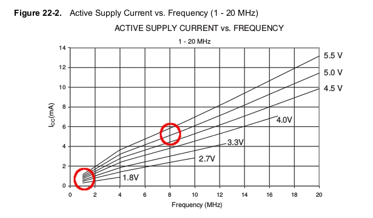

# RTT

Arduino IDE 1.8.7

## NodeMCU-esp8266
### Arduino support
- Go to File > Preferences.
- In the "Additional Boards Manager URLs" field, copy-paste :
  - http://arduino.esp8266.com/stable/package_esp8266com_index.json.
### Libs
- GxEPD (Version.3.0.2) (https://github.com/ZinggJM/GxEPD)
- Adafruit_GFX (Version.1.2.9) (https://github.com/adafruit/Adafruit-GFX-Library)
- NTPClient (Version.3.1.0) (https://github.com/arduino-libraries/NTPClient)
- ArduinoJson (Version.5.13.3) (https://github.com/bblanchon/ArduinoJson)
- Wire (I2C standar library) https://www.arduino.cc/en/Reference/Wire
- ElapsedMillis (1.0.4) https://github.com/pfeerick/elapsedMillis
### Arduino Flash config
- NodeMCU 1.0 (ESP-12E Module)
- CPU Frequency 80 mhz
### Power consumption
- DeepSleep implemantation...

## DIGISPARK-ATTiny85
TapSens - Sample a "pezo-sensor" and send hits count to NodeMCU master.
### Arduino support
** UNDER MACKINTOSH YOU WILL NEED A USB HUB TO PROGRAM THE DIGISPARK BOARD! **
- Instaling DIGISPARK support for Arduino
  - Add this link to the Arduino Préférences : http://digistump.com/package_digistump_index.json
  - Look for DIGISPARK into the Arduino bord manager
### Libs
- elapsedMillis (1.4.0) (http://github.com/pfeerick/elapsedMillis/wiki)
- TinyWireS https://github.com/rambo/TinyWire (Installation à la main depuis le repo Github!)
### Arduino Flash config
- Digispark (1mhz - No USB)
### Power consumption

